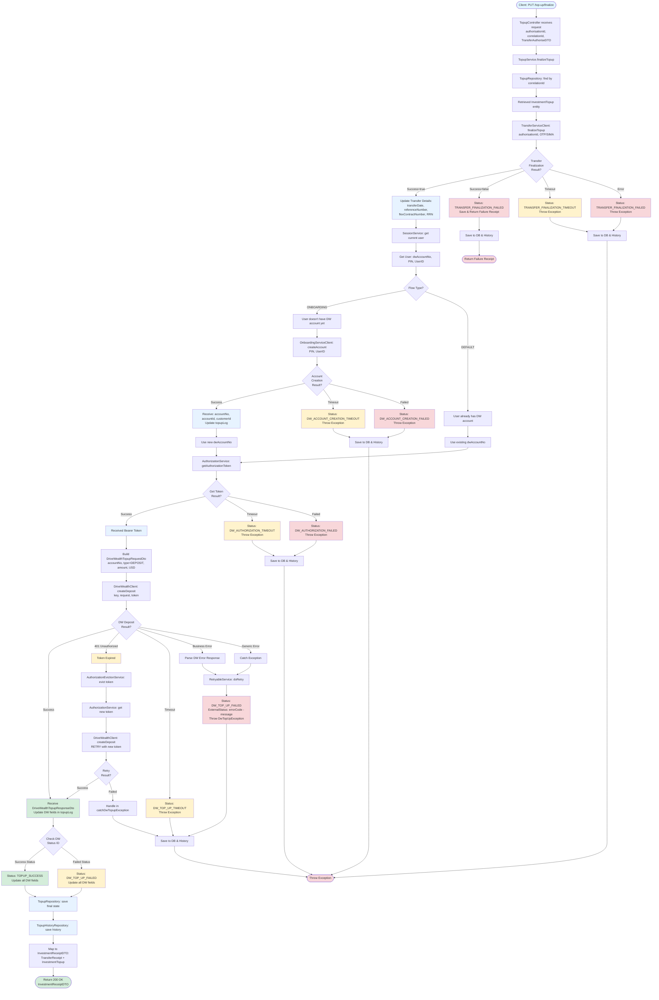

# Investment Top-Up Service - System Design & Sequence Flow

## Overview
This document provides a comprehensive system design and sequence flow for the Investment Top-Up functionality, covering the complete journey from API initiation to finalization.

## 📌 How to View Diagrams

This document contains **Mermaid diagrams** that render as visual flowcharts. To view them:

✅ **GitHub/GitLab**: Diagrams render automatically  
✅ **VS Code**: Install "Markdown Preview Mermaid Support" extension  
✅ **IntelliJ/WebStorm**: Built-in Mermaid support  
✅ **Online**: Copy to [mermaid.live](https://mermaid.live) for editing  

---

## Table of Contents
- [Architecture Overview](#architecture-overview)
- [System Architecture Diagram](#system-architecture-diagram)
- [Complete Top-Up Journey](#complete-top-up-journey-high-level)
- [Flow Diagrams](#flow-diagrams)
  - [Initiate Top-Up Flow](#initiate-top-up-flow)
  - [Finalize Top-Up Flow](#finalize-top-up-flow)
- [Status State Diagram](#status-state-diagram)
- [Components](#components)
- [Data Flow](#data-flow)
- [Error Handling](#error-handling)
- [Status Tracking](#status-tracking)

---

## Architecture Overview

The Investment Top-Up service follows a microservices architecture with the following key layers:

1. **Controller Layer**: REST API endpoints
2. **Service Layer**: Business logic orchestration
3. **Client Layer**: Integration with external services (Feign clients)
4. **Repository Layer**: Data persistence
5. **Validation Layer**: Input validation
6. **External Services**: Transfer Service, DriveWealth, Onboarding Service

---

## Components

### 1. TopupController
REST API controller exposing top-up endpoints:
- `POST /top-up/initiate` - Initiates a top-up transaction
- `PUT /top-up/finalize/{authorisationId}/{correlationId}` - Finalizes the top-up
- `GET /top-up/{correlationId}` - Gets transaction details
- `POST /top-up/users` - Creates DriveWealth account

### 2. TopupService (TopupServiceImpl)
Core business logic orchestrating:
- Transaction validation
- Transfer service integration
- DriveWealth deposit creation
- Account onboarding (if needed)
- Database logging and history tracking
- Error handling and retry mechanisms

### 3. External Clients

#### TransferServiceClient
Handles internal bank transfer operations:
- `initiateTopup()` - Initiates money transfer from customer account
- `finalizeTopup()` - Finalizes the transfer with OTP/authorization

#### DriveWealthClient
Integrates with DriveWealth broker:
- `getAuthorizationToken()` - Gets OAuth token
- `createDeposit()` - Creates deposit in investment account

#### OnboardingServiceClient
Handles user onboarding:
- `createAccount()` - Creates DriveWealth account for new users

### 4. Supporting Services

- **TopupValidator**: Validates request parameters
- **SessionService**: Manages user session context
- **FlexInfoService**: Fetches customer information from Flex system
- **AuthorizationService**: Manages DriveWealth OAuth tokens
- **AuthorizationEvictionService**: Handles token refresh
- **RetryableService**: Handles retry logic for failed operations

### 5. Repositories

- **TopupRepository**: Stores top-up transactions
- **TopupHistoryRepository**: Maintains audit trail of all operations

---

## System Architecture Diagram


---

## Complete Top-Up Journey (High-Level)


### Legend
- 🔵 **Blue** - Start/Entry points
- 🟢 **Green** - Success endpoints
- 🔴 **Red** - Error endpoints
- 🟡 **Yellow** - Warning/Timeout states
- ⚪ **Light Blue** - Data operations (DB, Cache)
- 💎 **Diamond** - Decision points

---

## Flow Diagrams

### Initiate Top-Up Flow


---

### Finalize Top-Up Flow



---

## Status State Diagram

This diagram shows all possible internal status transitions throughout the top-up lifecycle:


### Status Categories

#### ✅ Success States
- `TOPUP_SUCCESS` - Complete end-to-end success

#### ⏳ In-Progress States  
- `INITIAL` - Request received and validated
- `Authorized` - Transfer service authorization received
- `TransferSuccess` - Bank transfer completed
- `AccountReady` - DriveWealth account ready
- `TokenReady` - OAuth token obtained

#### ⚠️ Timeout States (Retryable)
- `TRANSFER_INITIATION_TIMEOUT`
- `TRANSFER_FINALIZATION_TIMEOUT`
- `DW_ACCOUNT_CREATION_TIMEOUT`
- `DW_AUTHORIZATION_TIMEOUT`
- `DW_TOP_UP_TIMEOUT`

#### ❌ Failed States
- `TRANSFER_INITIATION_FAILED` (Retryable)
- `TRANSFER_FINALIZATION_FAILED` (Not Retryable - funds not debited)
- `DW_ACCOUNT_CREATION_FAILED` (Retryable)
- `DW_AUTHORIZATION_FAILED` (Retryable)
- `DW_TOP_UP_FAILED` (Retryable)

---

## Data Flow

### Request/Response DTOs

#### TopupInitiationRequestDTO
```json
{
  "amount": "BigDecimal",
  "currency": "CurrencyEnum",
  "productNumber": "String",
  "productType": "CategoryProductTypeEnum",
  "calculatedRate": "BigDecimal",
  "flowType": "FlowTypeEnum (DEFAULT | ONBOARDING)",
  "correlationId": "String (required for ONBOARDING)",
  "frontendSimaReady": "boolean"
}
```

#### AuthorisationDTO (Response)
```json
{
  "authorisationId": "UUID",
  "correlationId": "String",
  "expiryTime": "LocalDateTime"
}
```

#### TransferAuthoriseDTO (Finalize Request)
```json
{
  "otpCode": "String",
  "simaStan": "String"
}
```

#### InvestmentReceiptDTO (Finalize Response)
```json
{
  "success": "boolean",
  "amount": "BigDecimal",
  "currency": "CurrencyEnum",
  "referenceNumber": "String",
  "transactionDate": "LocalDateTime",
  "statusText": "String",
  "correlationId": "String",
  "dwTopupId": "String",
  "internalStatus": "InternalTopupStatusEnum"
}
```

---

## Error Handling

### Internal Status Enumeration

The system tracks various internal statuses throughout the top-up lifecycle:

#### Initiation Phase
- `INITIAL` - Transaction initiated
- `TRANSFER_INITIATION_TIMEOUT` - Transfer service timeout
- `TRANSFER_INITIATION_FAILED` - Transfer service failed

#### Finalization Phase - Transfer
- `TRANSFER_FINALIZATION_TIMEOUT` - Transfer finalization timeout
- `TRANSFER_FINALIZATION_FAILED` - Transfer finalization failed

#### Finalization Phase - DW Account
- `DW_ACCOUNT_CREATION_TIMEOUT` - Account creation timeout
- `DW_ACCOUNT_CREATION_FAILED` - Account creation failed

#### Finalization Phase - DW Authorization
- `DW_AUTHORIZATION_TIMEOUT` - Authorization timeout
- `DW_AUTHORIZATION_FAILED` - Authorization failed

#### Finalization Phase - DW Deposit
- `DW_TOP_UP_TIMEOUT` - Deposit creation timeout
- `DW_TOP_UP_FAILED` - Deposit creation failed
- `TOPUP_SUCCESS` - Complete success

### Error Recovery Mechanisms

1. **Token Refresh**: Automatic retry with new token on 401 Unauthorized
2. **Retry Logic**: RetryableService handles retryable failures
3. **Timeout Handling**: Specific status codes for timeout scenarios
4. **Transaction History**: All operations logged to history table
5. **Idempotency**: Correlation ID prevents duplicate transactions

---

## Status Tracking

### Database Tables

#### investment_top_up (Main Table)
Stores the current state of each top-up transaction with fields:
- Transaction details (amount, currency, product info)
- User information (cif, fin, phone, userId)
- Transfer details (referenceNumber, transferDate, RRN)
- DriveWealth details (accountNo, accountId, topupId, status)
- Status tracking (internalTopupStatus, externalTopupStatus)
- Timestamps (createdDate, transferDate)

#### investment_top_up_history (Audit Table)
Maintains complete audit trail of all state changes.

### Flow Types

1. **DEFAULT Flow**: Standard top-up for existing investment users
   - User already has DriveWealth account
   - Skip account creation step

2. **ONBOARDING Flow**: First-time top-up during user onboarding
   - User doesn't have DriveWealth account yet
   - Requires account creation before deposit
   - Uses provided correlationId from onboarding process

---

## Integration Points

### 1. Transfer Service
**Base URL**: Configured via `client.base-url.transfer`

**Endpoints**:
- `POST /investment/top-up/initiate` - Initiates internal bank transfer
- `PUT /investment/top-up/finalize/{authorisationId}` - Finalizes transfer with OTP

**Purpose**: Handles money transfer from customer's bank account to investment account

### 2. DriveWealth API
**Base URL**: Configured via `client.base-url.drive-wealth`

**Endpoints**:
- `POST /auth/tokens` - Gets OAuth bearer token
- `POST /funding/deposits` - Creates deposit in investment account

**Purpose**: Creates deposits in broker investment accounts

### 3. Onboarding Service
**Base URL**: Configured via `client.base-url.onboarding`

**Endpoints**:
- `POST /broker/sign-in` - Creates DriveWealth account for new users

**Purpose**: Onboards new users to DriveWealth platform

### 4. Flex System
**Service**: FlexInfoService (internal)

**Purpose**: Fetches customer information (name, address, IBAN) from legacy banking system

### 5. Session Management
**Service**: SessionService (internal)

**Purpose**: Manages user authentication and session context

---

## Security Considerations

1. **Authentication**: 
   - User session validation via SessionService
   - DriveWealth OAuth 2.0 bearer tokens

2. **Authorization**:
   - User context verification
   - CIF/PIN validation

3. **Data Protection**:
   - Sensitive data logged to audit trail
   - PII handling in database

4. **Token Management**:
   - Token caching in AuthorizationService
   - Automatic token refresh on expiry
   - Token eviction service

---

## Performance Optimizations

1. **Token Caching**: DriveWealth tokens cached to reduce auth calls
2. **Async Processing**: History logging doesn't block main flow
3. **Connection Pooling**: Feign clients use connection pools
4. **Database Indexing**: Correlation ID indexed for fast lookups
5. **Retry Strategy**: Smart retry only for retryable errors

---

## Monitoring & Observability

### Logging Points
- Request/response at controller level
- Service method entry/exit
- External service calls
- Error scenarios with stack traces
- Status transitions

### Key Metrics to Monitor
- Top-up initiation success rate
- Top-up finalization success rate
- Average processing time
- DriveWealth API latency
- Transfer service latency
- Timeout occurrences
- Retry attempts

### Health Checks
- Database connectivity
- External service availability
- DriveWealth API health
- Transfer service health

---

## Best Practices

1. **Idempotency**: Use correlation IDs to prevent duplicate processing
2. **Graceful Degradation**: Specific error codes for different failure scenarios
3. **Audit Trail**: Complete history of all operations
4. **Retry Logic**: Automatic retries for transient failures
5. **Circuit Breaker**: Consider implementing for external services
6. **Timeout Configuration**: Proper timeout settings for all external calls
7. **Transaction Management**: Ensure database consistency
8. **Error Messages**: User-friendly error messages with technical details logged

---

## Conclusion

This Investment Top-Up service implements a robust, production-ready flow with:
- ✅ Comprehensive error handling
- ✅ Audit trail and history tracking
- ✅ Retry mechanisms
- ✅ Token refresh handling
- ✅ Support for both onboarding and standard flows
- ✅ Integration with multiple external services
- ✅ Proper status tracking throughout the lifecycle

The sequence diagrams and documentation provide complete visibility into the system behavior from API entry to successful top-up completion.

