# Investment Withdraw Service - System Design & Sequence Flow

## Overview
This document provides a comprehensive system design and sequence flow for the Investment Withdraw functionality, covering the complete journey from API initiation to finalization.

## 📌 How to View Diagrams

This document contains **Mermaid diagrams** that render as visual flowcharts. To view them:

✅ **GitHub/GitLab**: Diagrams render automatically  
✅ **VS Code**: Install "Markdown Preview Mermaid Support" extension  
✅ **IntelliJ/WebStorm**: Built-in Mermaid support  
✅ **Online**: Copy to [mermaid.live](https://mermaid.live) for editing  

---

## Table of Contents
- [Architecture Overview](#architecture-overview)
- [System Architecture Diagram](#system-architecture-diagram)
- [Complete Withdraw Journey](#complete-withdraw-journey-high-level)
- [Flow Diagrams](#flow-diagrams)
  - [Initiate Withdraw Flow](#initiate-withdraw-flow)
  - [Finalize Withdraw Flow](#finalize-withdraw-flow)
  - [Retry Withdraw Flow](#retry-withdraw-flow)
- [Status State Diagram](#status-state-diagram)
- [Components](#components)
- [Data Flow](#data-flow)
- [Error Handling](#error-handling)
- [Status Tracking](#status-tracking)

---

## Architecture Overview

The Investment Withdraw service follows a microservices architecture with the following key layers:

1. **Controller Layer**: REST API endpoints
2. **Service Layer**: Business logic orchestration with retry mechanisms
3. **Client Layer**: Integration with external services (Feign clients)
4. **Repository Layer**: Data persistence
5. **Cache Layer**: Redis for locking mechanism
6. **External Services**: Transfer Service, DriveWealth, Transfer Checker

---

## System Architecture Diagram


---

## Complete Withdraw Journey (High-Level)


### Legend
- 🔵 **Blue** - Start/Entry points
- 🟢 **Green** - Success endpoints
- 🔴 **Red** - Error endpoints
- 🟡 **Yellow** - Warning/Timeout states
- ⚪ **Light Blue** - Data operations (DB, Cache)
- 🔶 **Orange** - Background jobs
- 💎 **Diamond** - Decision points

---

## Flow Diagrams

### Initiate Withdraw Flow


---

### Finalize Withdraw Flow


---

### Retry Withdraw Flow (Background Job)


**Key Points:**
- Job runs on schedule (configured via cron expression)
- Only processes withdraws with `TRANSFER_FINALIZATION_TIMEOUT` status
- Checks actual transfer status from TransferCheckerMS
- If transfer succeeded, completes DriveWealth redemption
- If transfer failed, increments retry count
- Has max retry count limit configured

---

## Status State Diagram

This diagram shows all possible internal status transitions throughout the withdraw lifecycle:

```mermaid
stateDiagram-v2
    [*] --> INITIAL: Initiate Withdraw Request
    
    INITIAL --> CheckRestrictions: Validate
    CheckRestrictions --> [*]: Locked/Pending (WITHDRAW_IS_NOT_ALLOWED)
    
    CheckRestrictions --> TRANSFER_INITIATION_TIMEOUT: Transfer Service Timeout
    CheckRestrictions --> TRANSFER_INITIATION_FAILED: Transfer Service Failed
    CheckRestrictions --> Authorized: Transfer Initiated Successfully
    
    Authorized --> TRANSFER_FINALIZATION_TIMEOUT: Finalize Timeout
    Authorized --> TRANSFER_FINALIZATION_FAILED: Finalize Failed/Rejected
    Authorized --> TransferSuccess: Transfer Finalized Successfully
    
    TransferSuccess --> DW_AUTHORIZATION_TIMEOUT: Get Token Timeout
    TransferSuccess --> DW_AUTHORIZATION_FAILED: Get Token Failed
    TransferSuccess --> TokenReady: Token Obtained
    
    TokenReady --> DW_WITHDRAW_TIMEOUT: Redemption API Timeout
    TokenReady --> DW_WITHDRAW_FAILED: Redemption Failed/Business Error
    TokenReady --> WITHDRAW_SUCCESS: Redemption Created Successfully
    
    TRANSFER_FINALIZATION_TIMEOUT --> RetryJob: Background Job Picks Up
    RetryJob --> CheckTransferStatus: Query TransferCheckerMS
    
    CheckTransferStatus --> TokenReady: Transfer Was Successful
    CheckTransferStatus --> TRANSFER_FINALIZATION_TIMEOUT: Transfer Still Pending (Retry Again)
    CheckTransferStatus --> TRANSFER_FINALIZATION_FAILED: Transfer Failed (Give Up)
    
    TRANSFER_INITIATION_TIMEOUT --> [*]: End (Retryable)
    TRANSFER_INITIATION_FAILED --> [*]: End (Retryable)
    TRANSFER_FINALIZATION_FAILED --> [*]: End (Not Retryable)
    DW_AUTHORIZATION_TIMEOUT --> [*]: End (Retryable)
    DW_AUTHORIZATION_FAILED --> [*]: End (Retryable)
    DW_WITHDRAW_TIMEOUT --> [*]: End (Retryable)
    DW_WITHDRAW_FAILED --> [*]: End (Retryable)
    WITHDRAW_SUCCESS --> [*]: End (Success ✓)
    
    note right of CheckRestrictions
        Redis lock or
        pending/failed withdraw
        blocks new requests
    end note
    
    note right of TRANSFER_FINALIZATION_TIMEOUT
        Timeout status triggers
        background job retry
        mechanism
    end note
    
    note right of WITHDRAW_SUCCESS
        Final success state
        Funds withdrawn from
        DriveWealth account
    end note
```



### Status Categories

#### ✅ Success States
- `WITHDRAW_SUCCESS` - Complete end-to-end success

#### ⏳ In-Progress States  
- `INITIAL` - Request received and validated
- `Authorized` - Transfer service authorization received
- `TransferSuccess` - Bank transfer initiated
- `TokenReady` - OAuth token obtained

#### ⚠️ Timeout States (Retryable via Job)
- `TRANSFER_INITIATION_TIMEOUT`
- `TRANSFER_FINALIZATION_TIMEOUT` - **Triggers retry job**
- `DW_AUTHORIZATION_TIMEOUT`
- `DW_WITHDRAW_TIMEOUT`

#### ❌ Failed States
- `TRANSFER_INITIATION_FAILED` (Retryable)
- `TRANSFER_FINALIZATION_FAILED` (Not Retryable - transfer rejected)
- `DW_AUTHORIZATION_FAILED` (Retryable)
- `DW_WITHDRAW_FAILED` (Retryable)

#### 🚫 Blocked States
- `WITHDRAW_IS_NOT_ALLOWED` - Redis lock exists or pending/failed withdraws found

---

## Components

### 1. WithdrawController
REST API controller exposing withdraw endpoints:
- `POST /withdraw/initiate` - Initiates a withdrawal transaction
- `PUT /withdraw/finalize/{authorisationId}/{correlationId}` - Finalizes the withdrawal

### 2. WithdrawService (WithdrawServiceImpl)
Core business logic orchestrating:
- Transaction validation and restriction checks
- Redis locking mechanism (prevents concurrent withdrawals)
- Transfer service integration
- DriveWealth redemption creation
- Database logging and history tracking
- Error handling and retry mechanisms
- Background job support for timeout recovery

### 3. External Clients

#### TransferServiceClient
Handles internal bank transfer operations:
- `initiateWithdraw()` - Initiates money transfer to customer account
- `finalizeWithdraw()` - Finalizes the transfer with OTP/authorization
- `getTransferDetail()` - Gets transfer details by correlationId

#### DriveWealthClient
Integrates with DriveWealth broker:
- `getAuthorizationToken()` - Gets OAuth token
- `createWithdrawal()` - Creates redemption (withdrawal) from investment account

#### TransferCheckerMsClient
Verifies transfer status (used in retry job):
- `getTransferStatus()` - Gets transfer status by reference number

### 4. Supporting Services

- **SessionService**: Manages user session context
- **FlexInfoService**: Fetches customer information from Flex system
- **AuthorizationService**: Manages DriveWealth OAuth tokens
- **AuthorizationEvictionService**: Handles token refresh
- **RetryableService**: Handles retry logic for failed operations
- **RedisService**: Manages Redis locks and caching

### 5. Background Jobs

- **WithdrawTransferStatusUpdateJob**: Scheduled job that retries timeout withdrawals by checking actual transfer status

### 6. Repositories

- **WithdrawRepository**: Stores withdrawal transactions
- **WithdrawHistoryRepository**: Maintains audit trail of all operations

---

## Data Flow

### Request/Response DTOs

#### WithdrawInitiationRequestDTO
```json
{
  "amount": "BigDecimal",
  "currency": "CurrencyEnum",
  "productNumber": "String",
  "productType": "CategoryProductTypeEnum",
  "calculatedRate": "BigDecimal",
  "frontendSimaReady": "boolean"
}
```

#### AuthorisationDTO (Response)
```json
{
  "authorisationId": "UUID",
  "correlationId": "String",
  "expiryTime": "LocalDateTime"
}
```

#### TransferAuthoriseDTO (Finalize Request)
```json
{
  "otpCode": "String",
  "simaStan": "String"
}
```

#### InvestmentReceiptDTO (Finalize Response)
```json
{
  "success": "boolean",
  "amount": "BigDecimal",
  "currency": "CurrencyEnum",
  "referenceNumber": "String",
  "transactionDate": "LocalDateTime",
  "statusText": "String",
  "correlationId": "String",
  "dwWithdrawId": "String",
  "internalStatus": "InternalWithdrawStatusEnum"
}
```

---

## Error Handling

### Internal Status Enumeration

The system tracks various internal statuses throughout the withdraw lifecycle:

#### Initiation Phase
- `INITIAL` - Transaction initiated
- `TRANSFER_INITIATION_TIMEOUT` - Transfer service timeout
- `TRANSFER_INITIATION_FAILED` - Transfer service failed

#### Finalization Phase - Transfer
- `TRANSFER_FINALIZATION_TIMEOUT` - Transfer finalization timeout (triggers retry job)
- `TRANSFER_FINALIZATION_FAILED` - Transfer finalization failed

#### Finalization Phase - DW Authorization
- `DW_AUTHORIZATION_TIMEOUT` - Authorization timeout
- `DW_AUTHORIZATION_FAILED` - Authorization failed

#### Finalization Phase - DW Redemption
- `DW_WITHDRAW_TIMEOUT` - Redemption creation timeout
- `DW_WITHDRAW_FAILED` - Redemption creation failed
- `WITHDRAW_SUCCESS` - Complete success

### Error Recovery Mechanisms

1. **Redis Lock**: Prevents concurrent withdraw requests from same user
2. **Pending Check**: Blocks new withdrawals if user has pending/failed ones
3. **Token Refresh**: Automatic retry with new token on 401 Unauthorized
4. **Retry Job**: Background job retries timeout cases by checking actual transfer status
5. **Retry Logic**: RetryableService handles retryable failures
6. **Timeout Handling**: Specific status codes for timeout scenarios
7. **Transaction History**: All operations logged to history table
8. **Idempotency**: Correlation ID prevents duplicate transactions

### Withdraw Restrictions

User cannot initiate new withdraw if:
- Redis lock exists (key: `WITHDRAW_LOCK_PREFIX + dwAccountId`)
- Has pending/failed withdrawals with status:
  - DriveWealth status: `PENDING` or `FAILED`
  - Internal status: `TRANSFER_FINALIZATION_TIMEOUT`
- Above conditions checked from `withdrawRetryStartDate` onwards

---

## Status Tracking

### Database Tables

#### investment_withdraw (Main Table)
Stores the current state of each withdraw transaction with fields:
- Transaction details (amount, currency, product info)
- User information (cif, fin, phone, userId)
- Transfer details (referenceNumber, transferDate, RRN)
- DriveWealth details (accountNo, accountId, withdrawId, status, paymentRef)
- Status tracking (internalWithdrawStatus, externalWithdrawStatus)
- Retry tracking (retryAttemptCount)
- Timestamps (createdDate, transferDate)

#### investment_withdraw_history (Audit Table)
Maintains complete audit trail of all state changes.

---

## Integration Points

### 1. Transfer Service
**Base URL**: Configured via `client.base-url.transfer`

**Endpoints**:
- `POST /investment/withdraw/initiate` - Initiates internal bank transfer
- `PUT /investment/withdraw/finalize/{authorisationId}` - Finalizes transfer with OTP
- `GET /transfer-detail/{correlationId}` - Gets transfer details

**Purpose**: Handles money transfer from investment account to customer's bank account

### 2. DriveWealth API
**Base URL**: Configured via `client.base-url.drive-wealth`

**Endpoints**:
- `POST /auth/tokens` - Gets OAuth bearer token
- `POST /funding/redemptions` - Creates redemption (withdrawal) from investment account

**Purpose**: Creates redemptions in broker investment accounts

### 3. Transfer Checker Microservice
**Purpose**: Verifies actual status of transfers (used in retry mechanism)

**Endpoints**:
- Gets transfer status by reference number

### 4. Flex System
**Service**: FlexInfoService (internal)

**Purpose**: Fetches customer information (name, address, IBAN) from legacy banking system

### 5. Session Management
**Service**: SessionService (internal)

**Purpose**: Manages user authentication and session context

### 6. Redis Cache
**Purpose**: 
- Stores withdraw locks to prevent concurrent operations
- Caches OAuth tokens

**Keys**:
- `WITHDRAW_LOCK_PREFIX + dwAccountId` - Lock key per user
- Lock TTL configured via `redis.withdraw-lock-time-seconds`

---

## Background Job Configuration

### WithdrawTransferStatusUpdateJob

**Purpose**: Automatically retries withdrawals that timed out during transfer finalization

**Configuration Properties**:
- `withdraw.started-date` - Start date for checking withdrawals
- `retry.timeout.withdraw-retry-start-date` - From which date to retry
- `retry.timeout.withdraw-max-retry-count` - Maximum retry attempts

**Behavior**:
1. Runs on schedule (cron configured)
2. Queries withdrawals with `TRANSFER_FINALIZATION_TIMEOUT` status
3. Checks actual transfer status via TransferCheckerMS
4. If transfer succeeded → Creates DriveWealth redemption
5. If transfer failed → Increments retry count
6. Gives up after max retry count reached

---

## Security Considerations

1. **Authentication**: 
   - User session validation via SessionService
   - DriveWealth OAuth 2.0 bearer tokens

2. **Authorization**:
   - User context verification
   - CIF/PIN validation

3. **Concurrency Control**:
   - Redis locks prevent concurrent withdrawals
   - Check for pending/failed withdrawals

4. **Data Protection**:
   - Sensitive data logged to audit trail
   - PII handling in database

5. **Token Management**:
   - Token caching in AuthorizationService
   - Automatic token refresh on expiry
   - Token eviction service

---

## Performance Optimizations

1. **Token Caching**: DriveWealth tokens cached to reduce auth calls
2. **Redis Locks**: Fast distributed locking mechanism
3. **Async Processing**: History logging doesn't block main flow
4. **Connection Pooling**: Feign clients use connection pools
5. **Database Indexing**: Correlation ID and userId indexed for fast lookups
6. **Retry Strategy**: Smart retry only for retryable errors
7. **Background Jobs**: Offload retry logic to scheduled jobs

---

## Monitoring & Observability

### Logging Points
- Request/response at controller level
- Service method entry/exit
- External service calls
- Redis lock operations
- Retry job executions
- Error scenarios with stack traces
- Status transitions

### Key Metrics to Monitor
- Withdraw initiation success rate
- Withdraw finalization success rate
- Average processing time
- DriveWealth API latency
- Transfer service latency
- Timeout occurrences
- Retry attempts and success rate
- Redis lock contention
- Background job execution time

### Health Checks
- Database connectivity
- Redis connectivity
- External service availability
- DriveWealth API health
- Transfer service health
- Transfer checker service health

---

## Key Differences from Top-Up

| Aspect | Top-Up | Withdraw |
|--------|--------|----------|
| **Direction** | Customer Account → DriveWealth | DriveWealth → Customer Account |
| **DW Operation** | Deposit | Redemption |
| **Onboarding Flow** | Supported | Not needed (user already exists) |
| **Restrictions** | None | Redis lock + pending/failed check |
| **Lock Mechanism** | No | Yes (Redis lock during finalization) |
| **Retry Job** | No | Yes (WithdrawTransferStatusUpdateJob) |
| **Transfer Verification** | No | Yes (TransferCheckerMS) |
| **Concurrency** | Allowed | Prevented via locks |

---

## Best Practices

1. **Idempotency**: Use correlation IDs to prevent duplicate processing
2. **Graceful Degradation**: Specific error codes for different failure scenarios
3. **Audit Trail**: Complete history of all operations
4. **Retry Logic**: Automatic retries for transient failures via background jobs
5. **Circuit Breaker**: Consider implementing for external services
6. **Timeout Configuration**: Proper timeout settings for all external calls
7. **Transaction Management**: Ensure database consistency
8. **Error Messages**: User-friendly error messages with technical details logged
9. **Lock Management**: Always release locks in finally blocks
10. **Restriction Checks**: Prevent problematic concurrent operations

---

## Conclusion

This Investment Withdraw service implements a robust, production-ready flow with:
- ✅ Comprehensive error handling
- ✅ Audit trail and history tracking
- ✅ Retry mechanisms via background jobs
- ✅ Token refresh handling
- ✅ Redis-based locking for concurrency control
- ✅ Restriction checks to prevent issues
- ✅ Integration with multiple external services
- ✅ Proper status tracking throughout the lifecycle
- ✅ Transfer status verification for timeout recovery

The sequence diagrams and documentation provide complete visibility into the system behavior from API entry to successful withdrawal completion.

