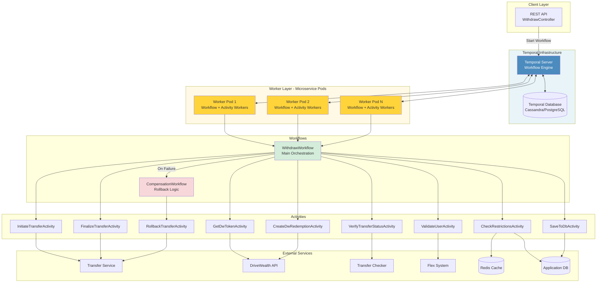
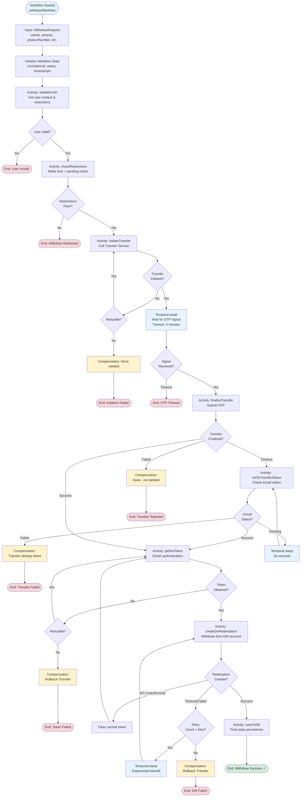
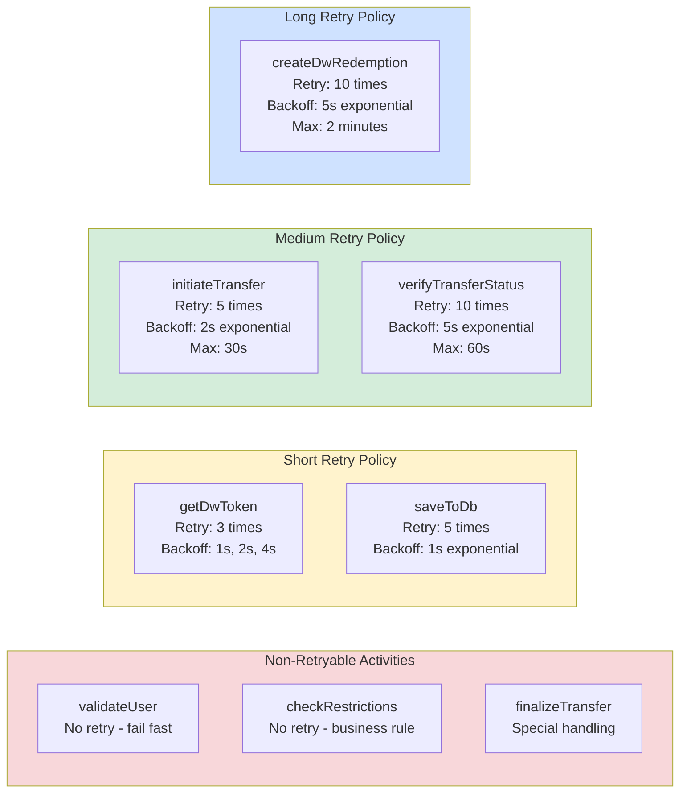
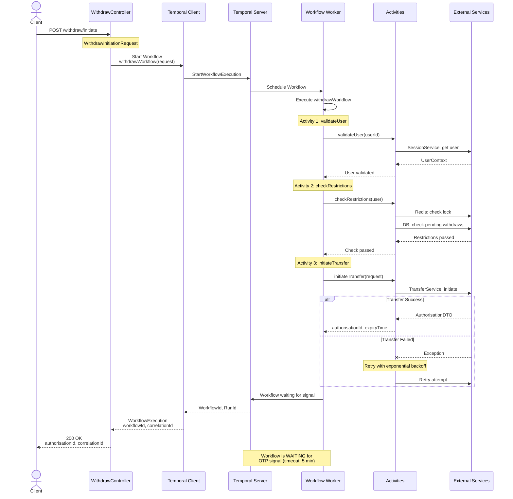
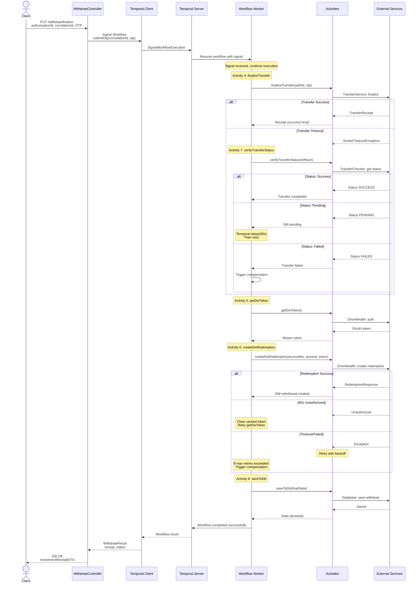
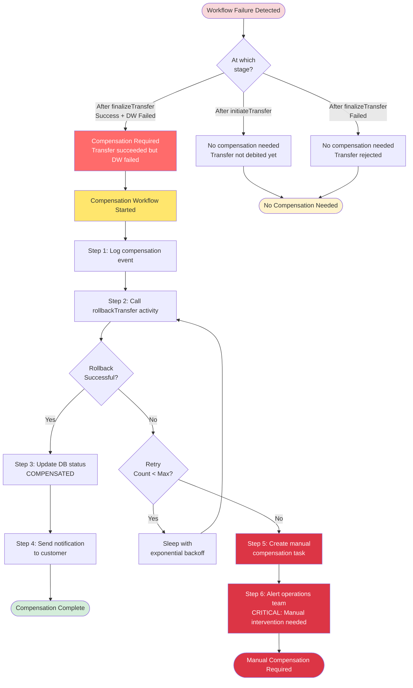
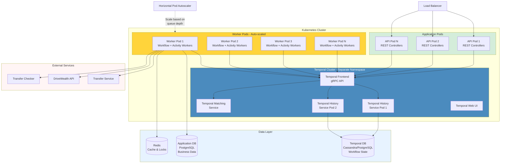

# Investment Withdraw Service - Temporal Workflow Implementation

## Overview
This document provides a comprehensive design for implementing the Investment Withdraw functionality using **Temporal Workflow Orchestration** for superior scalability, reliability, fault tolerance, and automatic retry mechanisms.

## 📌 How to View Diagrams

This document contains **Mermaid diagrams** that render as visual flowcharts. To view them:

✅ **GitHub/GitLab**: Diagrams render automatically  
✅ **VS Code**: Install "Markdown Preview Mermaid Support" extension  
✅ **IntelliJ/WebStorm**: Built-in Mermaid support  
✅ **Online**: Copy to [mermaid.live](https://mermaid.live) for editing  

---

## Table of Contents
- [Why Temporal?](#why-temporal)
- [Temporal Architecture](#temporal-architecture)
- [Workflow Design](#workflow-design)
- [Activity Definitions](#activity-definitions)
- [Complete Withdraw Flow](#complete-withdraw-flow-with-temporal)
- [Retry Policies](#retry-policies)
- [Saga Pattern (Compensation)](#saga-pattern-compensation)
- [Implementation Details](#implementation-details)
- [Deployment Architecture](#deployment-architecture)
- [Monitoring & Observability](#monitoring--observability)

---

## Why Temporal?

### Problems with Current Implementation

| Problem | Current Solution | Temporal Solution |
|---------|------------------|-------------------|
| **Timeout Recovery** | Background job polls database | Automatic workflow replay from checkpoint |
| **Retry Logic** | Manual retry service | Built-in activity retry policies |
| **State Management** | Database + Redis | Durable workflow state |
| **Concurrency Control** | Redis locks | Workflow signals + mutex |
| **Error Handling** | Try-catch everywhere | Activity-level error handling + compensation |
| **Visibility** | Custom logging | Built-in workflow history & UI |
| **Scalability** | Vertical scaling | Horizontal scaling of workers |
| **Code Complexity** | Scattered logic | Centralized workflow definition |

### Benefits of Temporal

✅ **Durability**: Workflows survive crashes and restarts  
✅ **Reliability**: Automatic retries with exponential backoff  
✅ **Visibility**: Complete audit trail in Temporal UI  
✅ **Scalability**: Horizontal scaling of workflow workers  
✅ **Simplicity**: No manual retry jobs or locks needed  
✅ **Testing**: Replay workflows in tests  
✅ **Long-running**: Workflows can run for months  
✅ **Saga Pattern**: Built-in compensation for failures  

---

## Temporal Architecture



---

## Workflow Design

### Withdraw Workflow Structure



---

## Activity Definitions

### Activity Interface Design

```java
@ActivityInterface
public interface WithdrawActivities {
    
    // Validation & Restriction Check
    UserContext validateUser(String userId);
    
    void checkRestrictions(UserContext user);
    
    // Transfer Operations
    AuthorisationDTO initiateTransfer(TransferRequest request);
    
    TransferReceipt finalizeTransfer(
        UUID authorisationId, 
        String otp, 
        String simaStan
    );
    
    TransferStatus verifyTransferStatus(String referenceNumber);
    
    // DriveWealth Operations
    String getDwToken();
    
    DriveWealthRedemptionResponse createDwRedemption(
        String accountNo,
        BigDecimal amount,
        String token
    );
    
    // Persistence
    void saveToDb(WithdrawState state);
    
    // Compensation
    void rollbackTransfer(String referenceNumber, String correlationId);
}
```

### Activity Retry Policies



---

## Complete Withdraw Flow with Temporal

### Phase 1: Initiate (API Call → Start Workflow)



---

### Phase 2: Finalize (API Call → Signal Workflow)



---

## Retry Policies

### Activity Retry Configuration

```yaml
activities:
  # Non-retryable activities
  validateUser:
    startToCloseTimeout: 10s
    retryPolicy:
      maximumAttempts: 1  # Fail fast
      
  checkRestrictions:
    startToCloseTimeout: 15s
    retryPolicy:
      maximumAttempts: 1  # Business rule check
      
  # Short retry activities
  getDwToken:
    startToCloseTimeout: 20s
    retryPolicy:
      initialInterval: 1s
      backoffCoefficient: 2.0
      maximumInterval: 10s
      maximumAttempts: 3
      nonRetryableErrorTypes:
        - InvalidCredentialsException
        
  saveToDb:
    startToCloseTimeout: 10s
    retryPolicy:
      initialInterval: 1s
      backoffCoefficient: 2.0
      maximumInterval: 30s
      maximumAttempts: 5
      
  # Medium retry activities
  initiateTransfer:
    startToCloseTimeout: 60s
    retryPolicy:
      initialInterval: 2s
      backoffCoefficient: 2.0
      maximumInterval: 30s
      maximumAttempts: 5
      nonRetryableErrorTypes:
        - InsufficientFundsException
        - AccountBlockedException
        
  verifyTransferStatus:
    startToCloseTimeout: 30s
    retryPolicy:
      initialInterval: 5s
      backoffCoefficient: 1.5
      maximumInterval: 60s
      maximumAttempts: 10
      
  # Long retry activities
  finalizeTransfer:
    startToCloseTimeout: 90s
    retryPolicy:
      initialInterval: 3s
      backoffCoefficient: 2.0
      maximumInterval: 60s
      maximumAttempts: 5
      nonRetryableErrorTypes:
        - OtpInvalidException
        - AuthorizationExpiredException
        
  createDwRedemption:
    startToCloseTimeout: 90s
    retryPolicy:
      initialInterval: 5s
      backoffCoefficient: 2.0
      maximumInterval: 120s
      maximumAttempts: 10
      nonRetryableErrorTypes:
        - InsufficientBalanceException
        - AccountSuspendedException
        
  # Compensation activities
  rollbackTransfer:
    startToCloseTimeout: 90s
    retryPolicy:
      initialInterval: 5s
      backoffCoefficient: 2.0
      maximumInterval: 60s
      maximumAttempts: 10  # Critical - must succeed
```

---

## Saga Pattern (Compensation)

### Compensation Flow



### Saga Implementation

```java
@WorkflowMethod
public WithdrawResult withdrawWorkflow(WithdrawRequest request) {
    WithdrawState state = new WithdrawState();
    List<CompensationAction> compensations = new ArrayList<>();
    
    try {
        // Step 1: Validate
        UserContext user = activities.validateUser(request.getUserId());
        state.setUser(user);
        
        // Step 2: Check restrictions
        activities.checkRestrictions(user);
        
        // Step 3: Initiate transfer
        AuthorisationDTO auth = activities.initiateTransfer(request);
        state.setAuthorisationId(auth.getAuthorisationId());
        // No compensation needed yet
        
        // Step 4: Wait for OTP signal
        Workflow.await(Duration.ofMinutes(5), () -> otpReceived);
        if (!otpReceived) {
            throw new OtpTimeoutException();
        }
        
        // Step 5: Finalize transfer
        TransferReceipt receipt = activities.finalizeTransfer(
            auth.getAuthorisationId(), otp, simaStan
        );
        state.setTransferReceipt(receipt);
        
        // ⚠️ CRITICAL POINT: Transfer succeeded - compensation needed if DW fails
        compensations.add(() -> 
            activities.rollbackTransfer(receipt.getReferenceNumber(), state.getCorrelationId())
        );
        
        // Step 6: Get DW token
        String token = activities.getDwToken();
        
        // Step 7: Create DW redemption
        DriveWealthRedemptionResponse dwResponse = 
            activities.createDwRedemption(user.getDwAccountNo(), request.getAmount(), token);
        state.setDwRedemptionId(dwResponse.getId());
        
        // Step 8: Save final state
        activities.saveToDb(state);
        
        return WithdrawResult.success(state);
        
    } catch (Exception e) {
        // Execute compensations in reverse order
        for (int i = compensations.size() - 1; i >= 0; i--) {
            try {
                compensations.get(i).compensate();
            } catch (Exception compEx) {
                // Log and alert - compensation failed
                Workflow.getLogger(WithdrawWorkflow.class)
                    .error("Compensation failed", compEx);
                // Create manual task for ops team
                activities.createManualCompensationTask(state, compEx);
            }
        }
        
        throw new WorkflowException("Withdraw failed", e);
    }
}
```

---

## Implementation Details

### Workflow Implementation

```java
@WorkflowInterface
public interface WithdrawWorkflow {
    
    @WorkflowMethod
    WithdrawResult execute(WithdrawRequest request);
    
    @SignalMethod
    void submitOtp(String otp, String simaStan);
    
    @QueryMethod
    WithdrawState getState();
}

@WorkflowImpl(taskQueue = "WITHDRAW_TASK_QUEUE")
public class WithdrawWorkflowImpl implements WithdrawWorkflow {
    
    private final WithdrawActivities activities;
    private WithdrawState state;
    private boolean otpReceived = false;
    private String otp;
    private String simaStan;
    
    public WithdrawWorkflowImpl() {
        this.activities = Workflow.newActivityStub(
            WithdrawActivities.class,
            ActivityOptions.newBuilder()
                .setStartToCloseTimeout(Duration.ofMinutes(2))
                .build()
        );
        this.state = new WithdrawState();
    }
    
    @Override
    public WithdrawResult execute(WithdrawRequest request) {
        state.setCorrelationId(UUID.randomUUID().toString());
        state.setStatus(WithdrawStatus.INITIATED);
        state.setCreatedAt(Workflow.currentTimeMillis());
        
        // Activity 1: Validate user
        UserContext user = activities.validateUser(request.getUserId());
        state.setUser(user);
        
        // Activity 2: Check restrictions
        activities.checkRestrictions(user);
        
        // Activity 3: Initiate transfer
        AuthorisationDTO authDto = activities.initiateTransfer(
            TransferRequest.builder()
                .amount(request.getAmount())
                .productNumber(request.getProductNumber())
                .correlationId(state.getCorrelationId())
                .build()
        );
        state.setAuthorisationId(authDto.getAuthorisationId());
        state.setStatus(WithdrawStatus.AWAITING_OTP);
        
        // Wait for OTP signal (timeout: 5 minutes)
        boolean signalReceived = Workflow.await(
            Duration.ofMinutes(5),
            () -> otpReceived
        );
        
        if (!signalReceived) {
            state.setStatus(WithdrawStatus.OTP_TIMEOUT);
            throw new OtpTimeoutException("OTP not received within 5 minutes");
        }
        
        state.setStatus(WithdrawStatus.FINALIZING_TRANSFER);
        
        // Activity 4: Finalize transfer with retry logic for timeout
        TransferReceipt receipt = finalizeTransferWithRetry(
            authDto.getAuthorisationId(), otp, simaStan
        );
        state.setTransferReceipt(receipt);
        state.setStatus(WithdrawStatus.TRANSFER_COMPLETED);
        
        // Activity 5: Get DW token
        String token = activities.getDwToken();
        
        // Activity 6: Create DW redemption with compensation support
        state.setStatus(WithdrawStatus.CREATING_DW_REDEMPTION);
        DriveWealthRedemptionResponse dwResponse = 
            createDwRedemptionWithRetry(user.getDwAccountNo(), request.getAmount(), token);
        state.setDwRedemptionId(dwResponse.getId());
        state.setStatus(WithdrawStatus.COMPLETED);
        
        // Activity 7: Save final state
        activities.saveToDb(state);
        
        return WithdrawResult.builder()
            .correlationId(state.getCorrelationId())
            .status(state.getStatus())
            .dwRedemptionId(dwResponse.getId())
            .transferReferenceNumber(receipt.getReferenceNumber())
            .build();
    }
    
    private TransferReceipt finalizeTransferWithRetry(
        UUID authorisationId, String otp, String simaStan
    ) {
        try {
            return activities.finalizeTransfer(authorisationId, otp, simaStan);
        } catch (SocketTimeoutException e) {
            // Transfer timed out - verify actual status
            return verifyAndCompleteTransfer(state.getCorrelationId());
        }
    }
    
    private TransferReceipt verifyAndCompleteTransfer(String correlationId) {
        int attempts = 0;
        while (attempts < 10) {
            Workflow.sleep(Duration.ofSeconds(30));
            
            TransferStatus status = activities.verifyTransferStatus(correlationId);
            
            if (status.isSuccess()) {
                return status.getReceipt();
            } else if (status.isFailed()) {
                throw new TransferFailedException("Transfer failed: " + status.getMessage());
            }
            // Status is pending, retry
            attempts++;
        }
        throw new TransferTimeoutException("Transfer status verification exceeded max attempts");
    }
    
    private DriveWealthRedemptionResponse createDwRedemptionWithRetry(
        String accountNo, BigDecimal amount, String token
    ) {
        try {
            return activities.createDwRedemption(accountNo, amount, token);
        } catch (UnauthorizedException e) {
            // Token expired - get new token and retry
            String newToken = activities.getDwToken();
            return activities.createDwRedemption(accountNo, amount, newToken);
        }
    }
    
    @Override
    public void submitOtp(String otp, String simaStan) {
        this.otp = otp;
        this.simaStan = simaStan;
        this.otpReceived = true;
    }
    
    @Override
    public WithdrawState getState() {
        return state;
    }
}
```

---

### Controller Implementation

```java
@RestController
@RequestMapping("/withdraw")
@RequiredArgsConstructor
@Slf4j
public class WithdrawController {
    
    private final WorkflowClient workflowClient;
    
    @PostMapping("/initiate")
    public ResponseDTO<WithdrawInitiateResponse> initiateWithdraw(
        @RequestBody @Valid WithdrawInitiationRequestDTO request
    ) {
        String workflowId = "WITHDRAW-" + UUID.randomUUID();
        
        // Start workflow
        WorkflowOptions options = WorkflowOptions.newBuilder()
            .setWorkflowId(workflowId)
            .setTaskQueue("WITHDRAW_TASK_QUEUE")
            .setWorkflowExecutionTimeout(Duration.ofHours(1))
            .build();
        
        WithdrawWorkflow workflow = workflowClient.newWorkflowStub(
            WithdrawWorkflow.class, 
            options
        );
        
        // Start workflow asynchronously
        WorkflowClient.start(workflow::execute, 
            WithdrawRequest.from(request)
        );
        
        // Query workflow state to get correlation ID
        WithdrawState state = workflow.getState();
        
        return ResponseDTO.<WithdrawInitiateResponse>builder()
            .data(WithdrawInitiateResponse.builder()
                .workflowId(workflowId)
                .correlationId(state.getCorrelationId())
                .authorisationId(state.getAuthorisationId())
                .build())
            .build();
    }
    
    @PutMapping("/finalize/{workflowId}")
    public ResponseDTO<InvestmentReceiptDTO> finalizeWithdraw(
        @PathVariable String workflowId,
        @RequestBody(required = false) TransferAuthoriseDTO request
    ) {
        // Get workflow stub
        WithdrawWorkflow workflow = workflowClient.newWorkflowStub(
            WithdrawWorkflow.class,
            workflowId
        );
        
        // Send signal to workflow
        workflow.submitOtp(request.getOtpCode(), request.getSimaStan());
        
        // Wait for workflow to complete (with timeout)
        try {
            WithdrawResult result = WorkflowStub.fromTyped(workflow)
                .getResult(Duration.ofMinutes(10), WithdrawResult.class);
            
            return ResponseDTO.<InvestmentReceiptDTO>builder()
                .data(InvestmentReceiptDTO.from(result))
                .build();
                
        } catch (TimeoutException e) {
            // Workflow still running - return current state
            WithdrawState state = workflow.getState();
            return ResponseDTO.<InvestmentReceiptDTO>builder()
                .data(InvestmentReceiptDTO.fromState(state))
                .build();
        }
    }
    
    @GetMapping("/status/{workflowId}")
    public ResponseDTO<WithdrawState> getWithdrawStatus(
        @PathVariable String workflowId
    ) {
        WithdrawWorkflow workflow = workflowClient.newWorkflowStub(
            WithdrawWorkflow.class,
            workflowId
        );
        
        WithdrawState state = workflow.getState();
        
        return ResponseDTO.<WithdrawState>builder()
            .data(state)
            .build();
    }
}
```

---

### Activity Implementation

```java
@Component
@RequiredArgsConstructor
@Slf4j
public class WithdrawActivitiesImpl implements WithdrawActivities {
    
    private final SessionService sessionService;
    private final TransferServiceClient transferServiceClient;
    private final DriveWealthClient driveWealthClient;
    private final AuthorizationService authorizationService;
    private final FlexInfoService flexInfoService;
    private final WithdrawRepository withdrawRepository;
    private final RedisService redisService;
    
    @Override
    @ActivityMethod
    public UserContext validateUser(String userId) {
        log.info("Activity: validateUser - userId={}", userId);
        
        User user = sessionService.getUserById(userId);
        FlexCustomerBriefInfoDTO flexInfo = flexInfoService
            .fetchCustomerInfo(user.getPin())
            .orElseThrow(() -> new CustomerNotFoundException(user.getPin()));
        
        return UserContext.builder()
            .userId(userId)
            .cif(user.getDefaultCif().orElseThrow())
            .pin(user.getPin())
            .phone(user.getPhone())
            .dwAccountNo(user.getDwAccountNo())
            .dwAccountId(user.getDwAccountId())
            .customerName(flexInfo.getName())
            .address(flexInfo.getAddress())
            .build();
    }
    
    @Override
    @ActivityMethod
    public void checkRestrictions(UserContext user) {
        log.info("Activity: checkRestrictions - dwAccountId={}", user.getDwAccountId());
        
        // Check Redis lock
        String lockKey = redisService.generateKey(
            WITHDRAW_LOCK_PREFIX, 
            user.getDwAccountId()
        );
        if (redisService.exists(lockKey)) {
            throw new WithdrawRestrictedException("Concurrent withdraw in progress");
        }
        
        // Check for pending/failed withdrawals
        LocalDateTime fromDate = LocalDate.parse(withdrawRetryStartDate).atStartOfDay();
        boolean hasPendingOrFailed = withdrawRepository
            .existsByUserIdAndDwStatusInOrInternalWithdrawStatusIn(
                user.getUserId(),
                List.of(PENDING.getMessage(), FAILED.getMessage()),
                List.of(InternalWithdrawStatusEnum.TRANSFER_FINALIZATION_TIMEOUT),
                fromDate
            );
        
        if (hasPendingOrFailed) {
            throw new WithdrawRestrictedException("Pending or failed withdraw exists");
        }
    }
    
    @Override
    @ActivityMethod
    public AuthorisationDTO initiateTransfer(TransferRequest request) {
        log.info("Activity: initiateTransfer - correlationId={}", request.getCorrelationId());
        
        WithdrawInitiationTransferRequestDTO transferRequest = 
            WithdrawInitiationTransferRequestDTO.builder()
                .amount(request.getAmount())
                .currency(CurrencyEnum.USD)
                .correlationId(request.getCorrelationId())
                .productNumber(request.getProductNumber())
                .frontendSimaReady(request.isFrontendSimaReady())
                .build();
        
        ResponseDTO<AuthorisationDTO> response = transferServiceClient
            .initiateWithdraw(headersSupply.get(), transferRequest);
        
        return response.getData();
    }
    
    @Override
    @ActivityMethod
    public TransferReceipt finalizeTransfer(
        UUID authorisationId, 
        String otp, 
        String simaStan
    ) {
        log.info("Activity: finalizeTransfer - authorisationId={}", authorisationId);
        
        TransferAuthoriseDTO authoriseDTO = TransferAuthoriseDTO.builder()
            .otpCode(otp)
            .simaStan(simaStan)
            .build();
        
        ResponseDTO<TransferReceiptDTO> response = transferServiceClient
            .finalizeWithdraw(authorisationId, authoriseDTO, headersSupply.get());
        
        if (!response.getData().isSuccess()) {
            throw new TransferFailedException(response.getData().getStatusText());
        }
        
        return TransferReceipt.from(response.getData());
    }
    
    @Override
    @ActivityMethod
    public TransferStatus verifyTransferStatus(String referenceNumber) {
        log.info("Activity: verifyTransferStatus - refNum={}", referenceNumber);
        
        var status = transferCheckerMsClient
            .getTransferStatus(referenceNumber)
            .getData();
        
        return TransferStatus.from(status);
    }
    
    @Override
    @ActivityMethod
    public String getDwToken() {
        log.info("Activity: getDwToken");
        return authorizationService.getAuthorizationToken();
    }
    
    @Override
    @ActivityMethod
    public DriveWealthRedemptionResponse createDwRedemption(
        String accountNo,
        BigDecimal amount,
        String token
    ) {
        log.info("Activity: createDwRedemption - accountNo={}, amount={}", 
            accountNo, amount);
        
        DriveWealthWithdrawRequestDto request = 
            DriveWealthWithdrawRequestDto.builder()
                .accountNo(accountNo)
                .type(DW_WITHDRAW_TYPE)
                .amount(amount)
                .currency(CurrencyEnum.USD)
                .build();
        
        DriveWealthWithdrawResponseDto response = driveWealthClient
            .createWithdrawal(key, request, token);
        
        if (!DwStatusEnum.findByCode(response.getStatus().getId()).isSuccess()) {
            throw new DwWithdrawException("DriveWealth redemption failed: " + 
                response.getStatus().getMessage());
        }
        
        return DriveWealthRedemptionResponse.from(response);
    }
    
    @Override
    @ActivityMethod
    public void saveToDb(WithdrawState state) {
        log.info("Activity: saveToDb - correlationId={}", state.getCorrelationId());
        
        InvestmentWithdraw withdraw = withdrawRepository
            .findFirstByCorrelationId(state.getCorrelationId())
            .orElse(new InvestmentWithdraw());
        
        // Map state to entity
        withdraw.setCorrelationId(state.getCorrelationId());
        withdraw.setAmount(state.getAmount());
        withdraw.setInternalWithdrawStatus(
            InternalWithdrawStatusEnum.WITHDRAW_SUCCESS
        );
        withdraw.setDwWithdrawId(state.getDwRedemptionId());
        // ... map other fields
        
        withdrawRepository.save(withdraw);
        withdrawHistoryRepository.save(withdrawHistoryMapper.map(withdraw));
    }
    
    @Override
    @ActivityMethod
    public void rollbackTransfer(String referenceNumber, String correlationId) {
        log.error("Activity: rollbackTransfer - CRITICAL - refNum={}, correlationId={}", 
            referenceNumber, correlationId);
        
        TransferReverseDTO reverseRequest = TransferReverseDTO.builder()
            .referenceNumber(referenceNumber)
            .correlationId(correlationId)
            .reason("DriveWealth redemption failed")
            .build();
        
        ResponseDTO<TransferReceiptDTO> response = transferServiceClient
            .reverseWithdraw(reverseRequest, headersSupply.get());
        
        if (!response.getData().isSuccess()) {
            throw new RollbackFailedException(
                "Transfer rollback failed: " + response.getData().getStatusText()
            );
        }
        
        log.info("Transfer successfully rolled back - refNum={}", referenceNumber);
    }
}
```

---

## Deployment Architecture



### Deployment Configuration

```yaml
# worker-deployment.yaml
apiVersion: apps/v1
kind: Deployment
metadata:
  name: withdraw-workflow-worker
spec:
  replicas: 3
  selector:
    matchLabels:
      app: withdraw-worker
  template:
    metadata:
      labels:
        app: withdraw-worker
    spec:
      containers:
      - name: worker
        image: investment-funding-ms:latest
        env:
        - name: TEMPORAL_SERVER_ADDRESS
          value: "temporal-frontend.temporal:7233"
        - name: TASK_QUEUE
          value: "WITHDRAW_TASK_QUEUE"
        - name: WORKER_MODE
          value: "true"
        - name: MAX_CONCURRENT_ACTIVITIES
          value: "100"
        - name: MAX_CONCURRENT_WORKFLOWS
          value: "50"
        resources:
          requests:
            memory: "512Mi"
            cpu: "500m"
          limits:
            memory: "2Gi"
            cpu: "2000m"
---
apiVersion: autoscaling/v2
kind: HorizontalPodAutoscaler
metadata:
  name: withdraw-worker-hpa
spec:
  scaleTargetRef:
    apiVersion: apps/v1
    kind: Deployment
    name: withdraw-workflow-worker
  minReplicas: 3
  maxReplicas: 20
  metrics:
  - type: Resource
    resource:
      name: cpu
      target:
        type: Utilization
        averageUtilization: 70
  - type: Pods
    pods:
      metric:
        name: temporal_task_queue_depth
      target:
        type: AverageValue
        averageValue: "100"
```

---

## Monitoring & Observability

### Temporal UI Dashboard

The Temporal Web UI provides:
- ✅ Real-time workflow execution status
- ✅ Complete history of all state transitions
- ✅ Activity retry attempts and failures
- ✅ Workflow inputs and outputs
- ✅ Stack traces for failures
- ✅ Search by correlationId, workflowId, userId
- ✅ Workflow replay for debugging

### Metrics to Monitor

```yaml
temporal_metrics:
  # Workflow metrics
  - temporal_workflow_completed_total
  - temporal_workflow_failed_total
  - temporal_workflow_timeout_total
  - temporal_workflow_execution_time_ms
  
  # Activity metrics
  - temporal_activity_completed_total
  - temporal_activity_failed_total
  - temporal_activity_retry_total
  - temporal_activity_execution_time_ms
  
  # Task queue metrics
  - temporal_task_queue_depth
  - temporal_task_latency_ms
  
  # Worker metrics
  - temporal_worker_task_slots_available
  - temporal_worker_task_slots_used
  
business_metrics:
  - withdraw_initiated_total
  - withdraw_completed_total
  - withdraw_failed_total
  - withdraw_compensated_total
  - withdraw_avg_duration_seconds
  - withdraw_otp_timeout_total
```

### Alerting Rules

```yaml
alerts:
  - name: HighWithdrawFailureRate
    condition: withdraw_failed_total / withdraw_initiated_total > 0.05
    severity: warning
    description: "More than 5% of withdrawals are failing"
    
  - name: CompensationRequired
    condition: withdraw_compensated_total > 0
    severity: critical
    description: "Compensation workflow triggered - manual check required"
    
  - name: WorkerQueueBacklog
    condition: temporal_task_queue_depth{queue="WITHDRAW_TASK_QUEUE"} > 1000
    severity: warning
    description: "Worker queue has significant backlog - consider scaling"
    
  - name: HighActivityRetryRate
    condition: rate(temporal_activity_retry_total[5m]) > 10
    severity: warning
    description: "High activity retry rate detected"
```

---

## Benefits Summary

### Scalability

| Aspect | Traditional | Temporal |
|--------|-------------|----------|
| **Horizontal Scaling** | Complex (need to manage state) | Simple (add more workers) |
| **Load Distribution** | Manual load balancer | Automatic by Temporal |
| **State Management** | Database + Redis | Built-in durable state |
| **Worker Coordination** | Complex locking | Built-in task distribution |

### Reliability

| Aspect | Traditional | Temporal |
|--------|-------------|----------|
| **Failure Recovery** | Manual retry jobs | Automatic workflow replay |
| **Partial Failures** | Complex state tracking | Automatic checkpoint & resume |
| **Timeouts** | Manual polling | Built-in timeout handling |
| **Compensation** | Manual implementation | Saga pattern support |

### Operational Excellence

| Aspect | Traditional | Temporal |
|--------|-------------|----------|
| **Debugging** | Log analysis | Workflow history & replay |
| **Monitoring** | Custom dashboards | Built-in Temporal UI |
| **Testing** | Integration tests | Workflow replay in tests |
| **Deployment** | Blue-green with state | Rolling updates (zero downtime) |

---

## Migration Strategy

### Phase 1: Parallel Run (4 weeks)
- Keep existing implementation running
- Deploy Temporal infrastructure
- Implement workflows for 10% of traffic
- Compare results and performance

### Phase 2: Gradual Rollout (6 weeks)
- Increase Temporal traffic to 50%
- Monitor metrics and error rates
- Fine-tune retry policies
- Train operations team

### Phase 3: Full Migration (4 weeks)
- Route 100% traffic to Temporal
- Keep old code for 2 weeks as fallback
- Monitor closely
- Remove old retry job

### Phase 4: Cleanup (2 weeks)
- Remove old implementation
- Remove Redis lock logic
- Optimize worker configuration
- Document lessons learned

---

## Conclusion

Implementing the withdraw process with **Temporal Workflow Orchestration** provides:

✅ **Automatic Retry** - No more manual retry jobs  
✅ **Fault Tolerance** - Workflows survive crashes  
✅ **Scalability** - Horizontal scaling of workers  
✅ **Visibility** - Complete audit trail in Temporal UI  
✅ **Simplicity** - Cleaner code, less boilerplate  
✅ **Reliability** - Built-in compensation (Saga pattern)  
✅ **Testability** - Replay workflows in tests  
✅ **Operational Excellence** - Better debugging and monitoring  

The investment in Temporal pays off with:
- 🚀 **Faster development** of new workflows
- 🛡️ **Higher reliability** and fault tolerance
- 📊 **Better visibility** into system behavior
- ⚡ **Easier scaling** for high traffic
- 🔧 **Simpler operations** and maintenance

**Total estimated effort**: 16 weeks (4 months)  
**ROI**: Significant reduction in operational overhead and incidents

