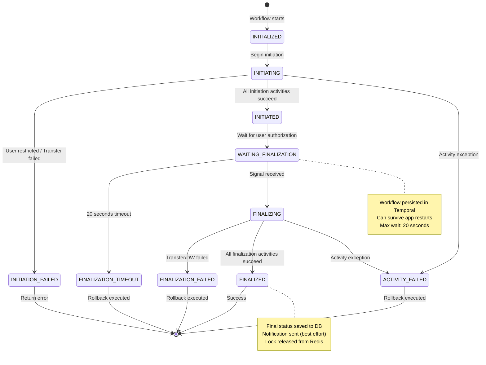
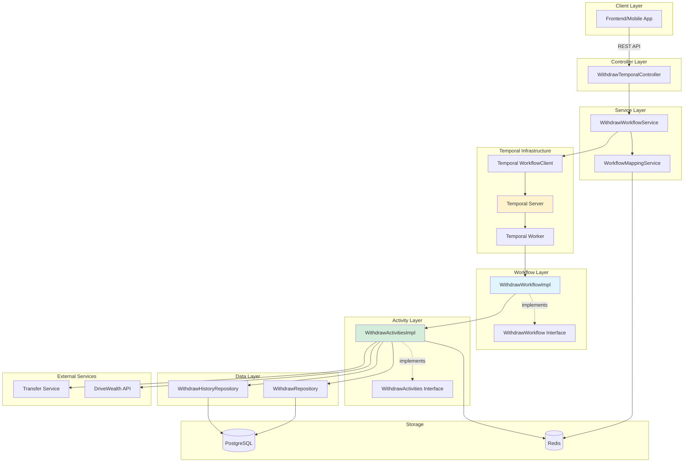
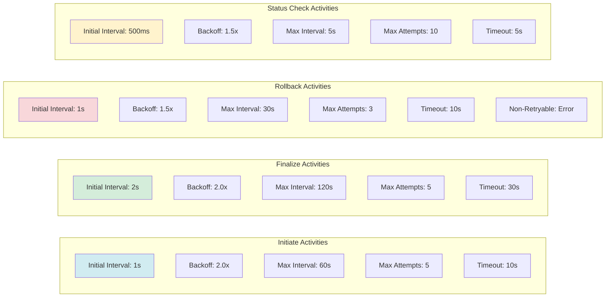
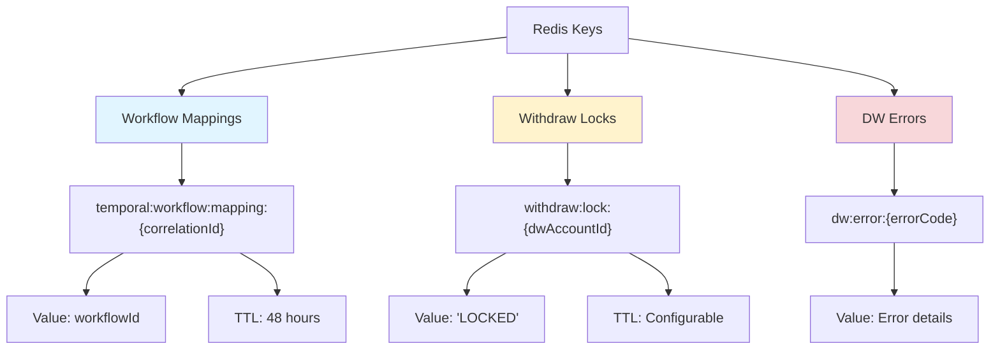
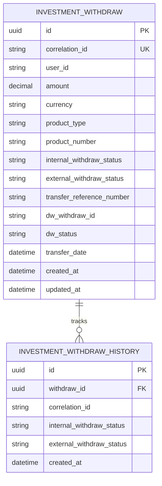

# Withdraw Flow - Comprehensive Diagram

## Complete Withdraw Flow with Temporal

This diagram shows the complete withdraw flow including initiation, waiting period, finalization, error handling, and all component interactions.

```mermaid
sequenceDiagram
    participant Client as Client/Frontend
    participant Controller as WithdrawTemporalController
    participant Service as WithdrawWorkflowService
    participant WFClient as Temporal WorkflowClient
    participant Temporal as Temporal Server
    participant Workflow as WithdrawWorkflowImpl
    participant Activities as WithdrawActivitiesImpl
    participant Redis as Redis
    participant DB as PostgreSQL Database
    participant Transfer as Transfer Service
    participant DW as DriveWealth API
    
    rect rgb(200, 220, 240)
    Note over Client,DW: PHASE 1: WITHDRAW INITIATION
    end
    
    Client->>+Controller: POST /withdraw/temporal/initiate
    Note right of Client: WithdrawInitiationRequestDTO<br/>(amount, product, currency)
    
    Controller->>+Service: initiateWithdraw(request)
    Service->>Service: Get user context from session
    Service->>Service: Generate workflowId<br/>(withdraw-{userId}-{timestamp})
    
    Service->>+WFClient: newWorkflowStub(WithdrawWorkflow.class, options)
    WFClient-->>-Service: workflow stub
    
    Service->>+WFClient: WorkflowClient.start(workflow::executeWithdraw)
    WFClient->>+Temporal: Start workflow execution
    Temporal->>+Workflow: executeWithdraw(request, userId, dwAccountId)
    
    Note over Workflow: State: INITIALIZED → INITIATING
    
    rect rgb(220, 240, 220)
    Note over Workflow,DB: INITIATION ACTIVITIES
    end
    
    Workflow->>Workflow: Generate correlationId (UUID)
    
    Workflow->>+Activities: createWithdrawDbLog(request, userId, correlationId)
    Activities->>+DB: INSERT INTO investment_withdraw
    DB-->>-Activities: Success
    Activities->>+DB: INSERT INTO investment_withdraw_history
    DB-->>-Activities: Success
    Activities-->>-Workflow: correlationId
    
    Workflow->>+Activities: checkWithdrawRestrictions(userId)
    Activities->>+Redis: exists(WITHDRAW_LOCK_PREFIX:{userId})
    Redis-->>-Activities: false
    Activities->>+DB: Check pending/failed withdraws
    DB-->>-Activities: No restrictions
    Activities-->>-Workflow: isRestricted = false
    
    alt User is restricted
        Workflow->>Workflow: State: INITIATION_FAILED
        Workflow-->>Temporal: Return failure response
        Temporal-->>WFClient: Failure
        WFClient-->>Service: Failure
        Service-->>Controller: ResponseDTO (error)
        Controller-->>Client: 400 Error - User restricted
    end
    
    Workflow->>+Activities: callTransferServiceInitiate(request, correlationId)
    Activities->>Activities: Build transfer request
    Activities->>+Transfer: POST /transfer/initiate
    
    alt Transfer Service Timeout
        Transfer--xActivities: Timeout (after retries)
        Activities->>DB: Update status: TRANSFER_INITIATION_TIMEOUT
        Activities--xWorkflow: Throw exception
        Workflow->>Workflow: State: INITIATION_FAILED
        Workflow->>Activities: rollbackWithdraw(correlationId)
        Activities->>DB: Update status: TRANSFER_FINALIZATION_FAILED
    end
    
    Transfer-->>-Activities: AuthorisationDTO<br/>(authorisationId, otpRequired, commission)
    Activities-->>-Workflow: AuthorisationDTO
    
    Workflow->>+Activities: saveWithdrawLog(correlationId, "INITIAL")
    Activities->>+DB: UPDATE investment_withdraw<br/>SET internal_status = 'INITIAL'
    DB-->>-Activities: Success
    Activities->>+DB: INSERT INTO history
    DB-->>-Activities: Success
    Activities-->>-Workflow: Success
    
    Note over Workflow: State: INITIATING → INITIATED
    Workflow->>Workflow: Store initiateResponse
    Workflow-->>-Temporal: Continue (await signal)
    
    Note over Temporal: Workflow persisted and waiting
    Temporal-->>-WFClient: Workflow started
    WFClient-->>-Service: Workflow started
    
    Service->>Service: Poll workflow.getCurrentState()<br/>(max 30 seconds)
    
    loop Poll until state changes
        Service->>+WFClient: workflow.getCurrentState()
        WFClient->>+Temporal: Query workflow
        Temporal->>+Workflow: getCurrentState()
        Workflow-->>-Temporal: "WAITING_FINALIZATION"
        Temporal-->>-WFClient: State
        WFClient-->>-Service: State
        Note over Service: State reached, exit loop
    end
    
    Service->>+WFClient: workflow.getInitiateResponse()
    WFClient->>+Temporal: Query workflow
    Temporal->>+Workflow: getInitiateResponse()
    Workflow-->>-Temporal: WithdrawInitiateResponse
    Temporal-->>-WFClient: Response
    WFClient-->>-Service: Response
    
    Service->>+Redis: storeMapping(correlationId, workflowId)
    Redis-->>-Service: Success
    Note right of Redis: Key: temporal:workflow:mapping:{correlationId}<br/>Value: {workflowId}<br/>TTL: 48 hours
    
    Service->>Service: Build AuthorisationDTO<br/>with correlationId
    Service-->>-Controller: ResponseDTO<AuthorisationDTO>
    Controller-->>-Client: 200 OK<br/>AuthorisationDTO (authorisationId, correlationId)
    
    rect rgb(255, 240, 200)
    Note over Client,DW: PHASE 2: WAITING FOR USER AUTHORIZATION (up to 20 seconds)
    end
    
    Note over Workflow: State: INITIATED → WAITING_FINALIZATION
    Workflow->>Workflow: Workflow.await(20 seconds,<br/>() -> finalizeRequest != null)
    
    Note over Client: User validates OTP/SIMA<br/>Gets authorization
    
    alt Timeout occurs (20 seconds)
        Note over Workflow: finalizeRequest is still null
        Workflow->>Workflow: State: FINALIZATION_TIMEOUT
        Workflow->>+Activities: saveWithdrawLog(correlationId, "TRANSFER_FINALIZATION_TIMEOUT")
        Activities->>DB: Update status
        Activities-->>-Workflow: Success
        Workflow->>+Activities: rollbackWithdraw(correlationId)
        Activities->>DB: Update status: TRANSFER_FINALIZATION_FAILED
        Activities-->>-Workflow: Success
        Workflow-->>Temporal: Return failure response<br/>(timeout error)
        Note over Temporal: Workflow completed with timeout
    end
    
    rect rgb(200, 240, 200)
    Note over Client,DW: PHASE 3: WITHDRAW FINALIZATION
    end
    
    Client->>+Controller: PUT /withdraw/temporal/finalize/{authId}/{correlationId}
    Note right of Client: TransferAuthoriseDTO<br/>(optional)
    
    Controller->>+Service: finalizeWithdraw(authId, correlationId, authDTO)
    Service->>Service: Get user context
    
    Service->>+Redis: getWorkflowId(correlationId)
    Redis-->>-Service: workflowId
    
    alt Workflow not found
        Service-->>Controller: Throw RuntimeException<br/>"Workflow not found"
        Controller-->>Client: 404 Error
    end
    
    Service->>+WFClient: newWorkflowStub(WithdrawWorkflow.class, workflowId)
    WFClient-->>-Service: workflow stub
    
    Service->>+WFClient: workflow.getCurrentState()
    WFClient->>+Temporal: Query state
    Temporal->>+Workflow: getCurrentState()
    Workflow-->>-Temporal: "WAITING_FINALIZATION"
    Temporal-->>-WFClient: State
    WFClient-->>-Service: "WAITING_FINALIZATION"
    
    Service->>Service: Build WithdrawFinalizeRequest
    Service->>+WFClient: workflow.finalizeWithdraw(finalizeRequest)
    WFClient->>+Temporal: Send signal to workflow
    Temporal->>+Workflow: finalizeWithdraw(request) [SIGNAL]
    Workflow->>Workflow: Set finalizeRequest = request
    Note over Workflow: Signal received!<br/>await() condition satisfied
    Workflow-->>-Temporal: Signal processed
    Temporal-->>-WFClient: Signal sent
    WFClient-->>-Service: Signal sent
    
    Note over Workflow: Await unblocked, continue execution
    Note over Workflow: State: WAITING_FINALIZATION → FINALIZING
    
    rect rgb(220, 240, 220)
    Note over Workflow,DW: FINALIZATION ACTIVITIES
    end
    
    Workflow->>+Activities: lockWithdraw(correlationId)
    Activities->>+DB: Find withdraw by correlationId
    DB-->>-Activities: InvestmentWithdraw
    Activities->>+Redis: SET lock key<br/>(WITHDRAW_LOCK_PREFIX:{dwAccountId})
    Redis-->>-Activities: Success
    Activities-->>-Workflow: Success
    
    Workflow->>+Activities: finalizeTransfer(finalizeRequest)
    Activities->>+DB: Find withdraw by correlationId
    DB-->>-Activities: InvestmentWithdraw
    
    Activities->>+Transfer: POST /transfer/finalize/{authId}
    Note right of Activities: Include authorization details
    
    alt Transfer Finalization Failed
        Transfer-->>Activities: Failure response
        Activities->>DB: Update status: TRANSFER_FINALIZATION_FAILED
        Activities-->>Workflow: false
        Workflow->>Workflow: State: FINALIZATION_FAILED
        Workflow->>Activities: rollbackWithdraw(correlationId)
        Workflow->>Activities: notifyWithdrawStatus("FAILED")
        Workflow->>Activities: unlockWithdraw(correlationId)
        Workflow-->>Temporal: Return failure response
    end
    
    Transfer-->>-Activities: TransferReceiptDTO<br/>(success, referenceNumber, etc.)
    Activities->>+DB: UPDATE withdraw<br/>(transferDate, referenceNumber, etc.)
    DB-->>-Activities: Success
    Activities->>+DB: INSERT INTO history
    DB-->>-Activities: Success
    Activities-->>-Workflow: true
    
    Workflow->>+Activities: getDriveWealthToken(correlationId)
    Activities->>+DB: Find withdraw by correlationId
    DB-->>-Activities: InvestmentWithdraw
    Activities->>Activities: authorizationService.getAuthorizationToken()
    
    alt DW Authorization Timeout
        Activities->>DB: Update status: DW_AUTHORIZATION_TIMEOUT
        Activities--xWorkflow: Throw exception
        Workflow->>Activities: rollbackWithdraw(correlationId)
        Workflow->>Activities: unlockWithdraw(correlationId)
    end
    
    Activities-->>-Workflow: dwToken
    
    Workflow->>+Activities: createDriveWealthWithdraw(correlationId, token)
    Activities->>+DB: Find withdraw by correlationId
    DB-->>-Activities: InvestmentWithdraw
    Activities->>Activities: Build DriveWealthWithdrawRequestDto
    Activities->>+DW: POST /accounts/{accountNo}/withdrawals
    Note right of Activities: Authorization: Bearer {token}
    
    alt DW API Unauthorized (401)
        DW-->>Activities: 401 Unauthorized
        Activities->>Activities: Evict cached token
        Activities->>Activities: Get new token
        Activities->>DW: Retry POST /accounts/{accountNo}/withdrawals
    end
    
    alt DW Withdraw Failed
        DW-->>Activities: Error response
        Activities->>DB: Update status: DW_WITHDRAW_FAILED
        Activities--xWorkflow: Throw exception
        Workflow->>Activities: rollbackWithdraw(correlationId)
        Workflow->>Activities: unlockWithdraw(correlationId)
    end
    
    DW-->>-Activities: DriveWealthWithdrawResponseDto<br/>(id, status, paymentRef)
    Activities->>+DB: UPDATE withdraw<br/>(dwWithdrawId, dwStatus, etc.)
    DB-->>-Activities: Success
    Activities->>+DB: INSERT INTO history
    DB-->>-Activities: Success
    Activities-->>-Workflow: Success
    
    Workflow->>+Activities: saveWithdrawLog(correlationId, "WITHDRAW_SUCCESS")
    Activities->>+DB: UPDATE investment_withdraw<br/>SET internal_status = 'WITHDRAW_SUCCESS'
    DB-->>-Activities: Success
    Activities->>+DB: INSERT INTO history
    DB-->>-Activities: Success
    Activities-->>-Workflow: Success
    
    Note over Workflow: State: FINALIZING → FINALIZED
    
    Workflow->>+Activities: unlockWithdraw(correlationId)
    Activities->>+Redis: DELETE lock key
    Redis-->>-Activities: Success
    Activities-->>-Workflow: Success
    
    Workflow->>+Activities: notifyWithdrawStatus(correlationId, "SUCCESS", userId)
    Note right of Activities: Send notifications (email, SMS, push)<br/>Best effort - errors don't fail workflow
    Activities-->>-Workflow: Success
    
    Workflow->>Workflow: Build WithdrawFinalizeResponse<br/>(success=true, receipt)
    Workflow-->>-Temporal: WithdrawFinalizeResponse
    
    Note over Temporal: Workflow completed successfully
    
    Service->>+WFClient: untypedStub.getResult()
    Note right of Service: Wait for workflow completion
    WFClient->>+Temporal: Get workflow result
    Temporal-->>-WFClient: WithdrawFinalizeResponse
    WFClient-->>-Service: Response
    
    Service->>Service: Extract receipt from response
    Service-->>-Controller: InvestmentReceiptDTO
    
    Controller->>Controller: Build ResponseDTO
    Controller-->>-Client: 200 OK<br/>InvestmentReceiptDTO (receipt details)
    
    rect rgb(255, 200, 200)
    Note over Client,DW: ERROR HANDLING & COMPENSATION
    end
    
    Note over Workflow,Activities: On any activity failure after max retries:
    Note over Workflow: 1. State → ACTIVITY_FAILED
    Note over Workflow: 2. Execute rollbackWithdraw(correlationId)
    Note over Workflow: 3. Return failure response
    
    Note over Activities,DB: Rollback activity updates DB status<br/>Best effort - errors don't fail workflow
    
    Note over Workflow: Temporal Features:
    Note over Workflow: ✓ Automatic state persistence
    Note over Workflow: ✓ Activity retry with exponential backoff
    Note over Workflow: ✓ Workflow continues after app restart
    Note over Workflow: ✓ Complete execution history in Temporal UI
    Note over Workflow: ✓ Configurable timeouts at all levels
```

## State Transition Diagram



## Component Architecture



## Activity Retry Configuration



## Redis Keys Structure



## Database Schema Simplified



## Key Benefits of Temporal Implementation

1. **Automatic State Persistence**: Workflow state automatically saved by Temporal
2. **Failure Recovery**: Workflows resume after application restarts
3. **Long-Running Operations**: Support for operations spanning minutes/hours/days
4. **Visibility**: Complete execution history in Temporal UI (http://localhost:8080)
5. **Retry Policies**: Configurable exponential backoff for activities
6. **Compensation Logic**: Automated rollback on failures
7. **Idempotency**: Duplicate workflow prevention via workflow IDs
8. **Scalability**: Horizontal scaling by adding more workers
9. **Deterministic Execution**: Replays from history guarantee consistency
10. **Signal/Query Pattern**: External interaction with running workflows

## Configuration Summary

- **Workflow Timeout**: 24 hours (configurable)
- **User Authorization Timeout**: 20 seconds (waiting for finalization)
- **Activity Timeouts**: 5-30 seconds depending on operation
- **Max Retries**: 3-10 depending on activity criticality
- **Redis Mapping TTL**: 48 hours
- **Withdraw Lock TTL**: Configurable (seconds)

